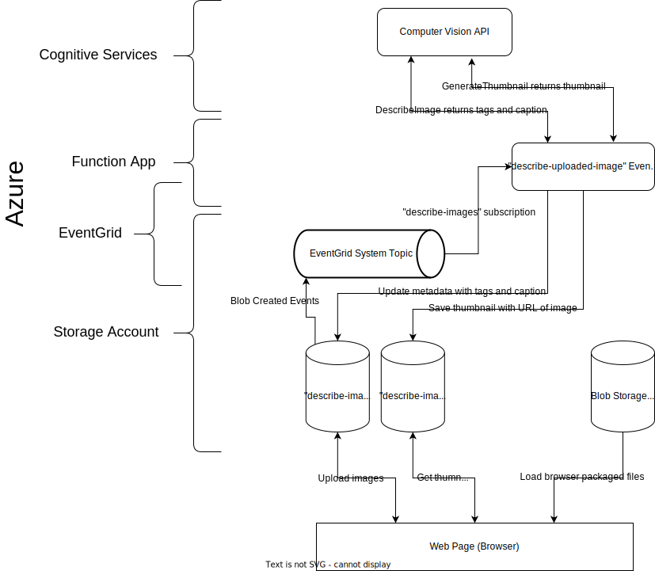

# describe-image

The describe-image application leverages Microsoft Azure resources to host a website where users can upload images that can later be viewed along with an AI generated description. If it's determined that an image doesn't clearly feature a car the application, disapointed as it is, only describes the image as missing a car. 

## Requirements

A web application that describes a car.

## Design

## Known issues | limitations

- Azure Computer Vision describe image endpoint sometimes doesn't identify the image as containing a car if the car is only partially visible, far away, or otherwise obscured.
- Azure Computer Vision describe image endpoint captions don't describe more than a car's orientation, color, and general action.
- Deleting uploaded images isn't supported.